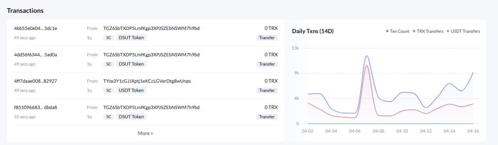

# Tron Scan Lite
Решение тестового задания для ООО Форкитех

## Необходимое ПО:
- [Docker](https://docs.docker.com/engine/install/) устанавливайте в зависимости от вашей ОС
- [Python](https://www.python.org/downloads/release/python-3120/)


## Запуск
- Склонируйте репозиторий 
- Откройте терминал в корне проекта
- Выполните следующую команду:
```sh
docker compose up -d
```

Отлично, __чтобы открыть api документацию__, перейдите по этому адресу
```
http://localhost:8081/ui-swagger
```

### Запуск тестов
Откройте терминал в корневой папке проекта и выполните следующие команды
```sh
python -m venv .venv
```

В зависимости от вашей ОС
```sh
source .venv/bin/activate #linux
# или
.\.venv\Scripts\activate #windows
```

```sh
pip install -r requirements.txt
```

```sh
pytest -v
```


## Пояснение и инструкции к решению
Решение работает с __тестовой сетью__ Tron — __shasta__. По этому используйте адреса из тестовой сети [по этой ссылке]( https://shasta.tronscan.org/)

На сайте в разделе как на скрине ниже копируйте любой адресс __From:__




Или вот парочка адресов, для вашего удобтва:

- TLSgRcoeokT8mSB8Fsm9FYw3bAHmCijLkZ
- TGAsYqmz2DF41tqSmHzRpJe4frgnkmTSCw
- TPPJeMAL38vnGyA7okhEv6QEg6VPvYVK6z
- TJwoFcjbwyoExajXjwktUEatLdkaVaTSDe
- TGeUXHdW5946LoiCkVxb57R6cx1MvcvQiu
- TK1tznW9vaL6WEzkjn5y1zGbvjvor1mN9g
- TK1tznW9vaL6WEzkjn5y1zGbvjvor1mN9g
- TNy7RXWEcKEs8qRnXLHhcgcjxFkS4DiUzw
- TUNfXYmHh8GDRyqP4rqohsoHYGrLbv6kj7